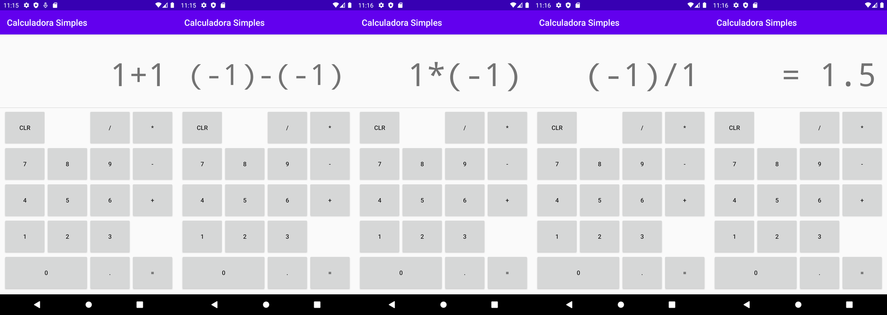

# Calculadora Simples para Android
Atividade avaliativa realizada em Abril de 2020, durante o curso de Análise e Desenvolvimento de Sistemas pelo Centro Universitário Internacional - UNINTER.

# Introdução
Uma calculadora simples com botões numéricos e 4 operações implementada através de uma variação do *state pattern*.

# Iniciando
Este projeto usa o sistema de compilação Gradle.

Não há configuração para o modo release. Para compilar utilize o comando `gradlew assembleDebug` e, para iniciar em um emulador ou telefone conectado via ADB, `gradlew installDebug`.

Ou, alternativamente, importe o projeto diretamente no Android Studio.

# Capturas de Tela

# Licença
MIT License
